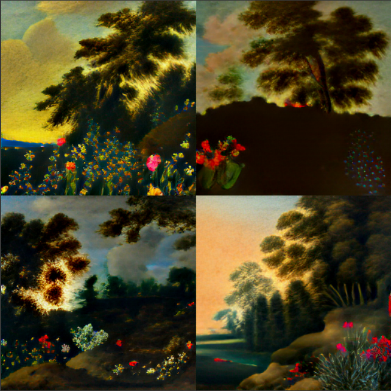

# 🎨 Task 02 – Generative AI Image Generation  
**Internship Project – Prodigy Infotech**

## 📌 Overview
This project is part of my internship at **Prodigy Infotech** under the domain of **Generative AI**.  
In this task, I explored how pre-trained models like **DALL·E Mini** can generate images based on textual descriptions (text prompts), enabling machines to transform words into visuals.

---

## 🎯 Objectives
- Understand and implement **text-to-image generation** using open-source AI models.
- Generate unique images from **custom text prompts**.
- Gain practical experience with **generative AI tools** and workflows.

---

## 🧠 Model Used
- **DALL·E Mini (Craiyon)**  
  A lightweight, open-source alternative to OpenAI’s DALL·E, capable of generating AI-based images from simple text inputs.

---

## 🛠️ Tools & Technologies
- Python  
- Google Colab  
- Hugging Face Transformers  
- DALL·E Mini (Craiyon)

---

## 🚀 How It Works
1. Install required libraries (transformers, flax, etc.)
2. Load the DALL·E Mini pipeline
3. Input a custom text prompt
4. Generate and save the output image

---

---

## 📸 Sample Output

**Prompt:** "A Landscape with Flowers"

  

## ✅ Status
✔️ **Task Completed** – Submitted as part of Task 02 for my internship at **Prodigy Infotech**.

---

## 📚 Learning Outcomes
- Gained foundational experience in **Generative AI**
- Understood real-world applications of **text-to-image models**
- Learned how to work with Hugging Face APIs and pre-trained models

---

## 📬 Connect With Me
**Tanmay Margaj**  
🔗 [LinkedIn](www.linkedin.com/in/tanmay-margaj-5598542bb)   
📧 tanmaymargaj35@gmail.com 

---

## 🏷️ Tags
`#GenerativeAI` `#DALLEMini` `#Internship` `#TextToImage` `#AIProject` `#ProdigyInfotech`

